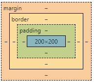

💡🚀🤟👉👇☀️🍉🍍🍇🍓🥕🍭🎖️🎁☘️🍀💯🔆❗🔥🚩

### 一、盒子模型💡

#### 1.含义☀️

当对一个文档进行布局时，浏览器的渲染引擎会根据渲染标准之一的CSS基础框盒模型，将所有的元素表示为一个个矩形的盒子，该模型描述了元素所占空间构成。css有两种和模型：W3C标准盒模型 和 IE怪异盒模型。

#### 2.盒子组成内容

一个盒子内容由四部分组成：内容(content)、内边距(padding,不可为负)、边框(border)、外边距(margin)，如下图所示👇：

#### 3.两种盒模型对比

|      | W3C标准盒模型                       | IE怪异盒模型                              |
| ---- | ----------------------------------- | ----------------------------------------- |
| 触发 | HTML默认（box-sizing: content-box） | 需设置（box-sizing: border-box）          |
| 区别 | width/height = content              | width/height = content + padding + border |

### 二、BFC💡

#### 1.含义☀️

块格式化上下文（Block Formatting Context，BFC）， 是Web页面的可视化CSS渲染的一部分，是块级盒子的布局过程发生的区域，也是浮动元素与其他元素交互的区域。

个人理解：BFC为web页面的可视化CSS渲染中的一种渲染格式，它是一个完全独立的布局环境（BFC盒子里的子元素布局不会影响到BFC盒子外的元素），BFC其实可以看做是CSS的一种属性。

#### 2.BFC的特点

| 序号 | 特点/规则                                                    |
| :--: | ------------------------------------------------------------ |
|  1   | BFC是一个块级元素，内部的盒子会在垂直方向一个接一个排列      |
|  2   | BFC在页面中是一个独立的容器，容器里面的元素不会影响到外部元素 |
|  3   | 垂直方向的的距离由margin决定，属于同一个BFC的两个相邻的外边距会发生重叠 |
|  4   | 计算BFC高度时，浮动元素也参与计算                            |

#### 3.怎样触发BFC

- overflow: hidden/auto/scroll（overflow值不为visible时）

- display: inline-block（设置为行内块时）
- position: absolute/fixed（设置为相对定位或绝对定位）
- display: table-cell（设置为表格单元格时）

- display: flex（弹性盒子）

#### 4.利用BFC可解决的一些问题✨

- 塌陷现象,坑爹现象（overflow: hidden; || display; ||  inline - block; || 浮动/弹性盒子 || 设置padding-top/margin-top）

- 清除浮动（overflow: hidden; || 给父元素设置足够高度 || 双伪元素）

  

### 三、CSS选择器及权重优先级

#### 1.选择器包括

​	通配符（*）、标签选择器、类选择器、ID选择器、伪类选择器（hover）、后代选择器（空格）、子代选择器（>）、交集选择器（两挨着写）、并集选择器（,）、类选择器

#### 2.权重优先级

##### (1)单个选择器

​		继承 < 通配符选择器 < 标签选择器 < 类选择器 < id选择器 < 行内样式 <  !important

##### (2)复合选择器

​	通过计算：🥕（行内样式数量，id选择器数量，类选择器数量，标签选择器数量）🥕来计算比较。（比较规则：从行内往右数，出现第一个数量不为0的选择器数量则其优先级最高，数量相同便依次比较后面选择器数量，全部相同就是层叠性；）

​	

​	文字描述：优先根据单个选择器的比较规则，当单个选择器的级别相同时，再比较相同选择器的数量，数量越多权重越大，当选择器级别及对应级别的数量都相同时，则会发生层叠性。
