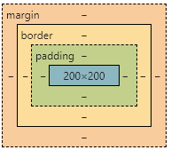

💡🚀🤟👉👇☀️🍉🍍🍇🍓🥕🍭🎖️🎁☘️🍀💯🔆❗🔥🚩

### 一、盒子模型💡

#### 1.含义☀️

当对一个文档进行布局时，浏览器的渲染引擎会根据渲染标准之一的CSS基础框盒模型，将所有的元素表示为一个个矩形的盒子，该模型描述了元素所占空间构成。css有两种和模型：W3C标准盒模型 和 IE怪异盒模型。


#### 2.盒子组成内容

一个盒子内容由四部分组成：内容(content)、内边距(padding,不可为负)、边框(border)、外边距(margin)，如下图所示👇：



#### 3.两种盒模型对比

|      | W3C标准盒模型                       | IE怪异盒模型                              |
| ---- | ----------------------------------- | ----------------------------------------- |
| 触发 | HTML默认（box-sizing: content-box） | 需设置（box-sizing: border-box）          |
| 区别 | width/height = content              | width/height = content + padding + border |


### 二、BFC💡

#### 1.含义☀️

块格式化上下文（Block Formatting Context，BFC）， 是Web页面的可视化CSS渲染的一部分，是块级盒子的布局过程发生的区域，也是浮动元素与其他元素交互的区域。

个人理解：BFC为web页面的可视化CSS渲染中的一种渲染格式，它是一个完全独立的布局环境（BFC盒子里的子元素布局不会影响到BFC盒子外的元素），BFC其实可以看做是CSS的一种属性。

#### 2.BFC的特点

| 序号 | 特点/规则                                                    |
| :--: | ------------------------------------------------------------ |
|  1   | BFC是一个块级元素，内部的盒子会在垂直方向一个接一个排列      |
|  2   | BFC在页面中是一个独立的容器，容器里面的元素不会影响到外部元素 |
|  3   | 垂直方向的的距离由margin决定，属于同一个BFC的两个相邻的外边距会发生重叠 |
|  4   | 计算BFC高度时，浮动元素也参与计算                            |

#### 3.怎样触发BFC

- 根标签

- overflow: hidden/auto/scroll（overflow值不为visible时）

- display: inline-block（设置为行内块时）
- position: absolute/fixed（设置为相对定位或绝对定位）
- display: table-cell（设置为表格单元格时）

- display: flex（弹性盒子）

#### 4.利用BFC可解决的一些问题✨

- 塌陷现象,坑爹现象（overflow: hidden; || display; ||  inline - block; || 浮动/弹性盒子 || 设置padding-top/margin-top）

- 清除浮动（overflow: hidden; || 给父元素设置足够高度 || 双伪元素）

- 避免浮动元素影响非浮动元素（如：给非浮动元素设置overflow: hidden;）

  

### 三、CSS选择器及权重优先级💡

#### 1.选择器包括

​	通配符（*）、标签选择器、类选择器、ID选择器、伪类选择器（hover）、后代选择器（空格）、子代选择器（>）、交集选择器（两挨着写）、并集选择器（,）、类选择器

#### 2.权重优先级

##### (1)单个选择器

​		继承 < 通配符选择器 < 标签选择器 < 类选择器 < id选择器 < 行内样式 <  !important

##### (2)复合选择器

​	通过计算：🥕（行内样式数量，id选择器数量，类选择器数量，标签选择器数量）🥕来计算比较。（比较规则：从行内往右数，出现第一个数量不为0的选择器数量则其优先级最高，数量相同便依次比较后面选择器数量，全部相同就是层叠性；）

​	

​	文字描述：优先根据单个选择器的比较规则，当单个选择器的级别相同时，再比较相同选择器的数量，数量越多权重越大，当选择器级别及对应级别的数量都相同时，则会发生层叠性。

### 四、常见盒子垂直、水平居中方式💡


#### 1.子绝父相的四种方法👇

（1）知道自身盒子宽高的情况下（负margin）

```
  // 父元素 相对定位 relative
  // 子元素  绝对定位
    position: absolute;
    top: 50%;
    left: 50%;
    margin-top: -50px;
    margin-left: -50px;
```

（2）知道自身盒子宽高的情况下（利用 calc 属性值）

```
//父盒子
.parent {
    position: relative;
}
//子盒子
.child {
    position: absolute;
    top: calc(50% - 50px);
    left: calc(50% - 50px);
}
```

（3）不知道/知道自身宽高的情况下（transform:  translate）

```
    //子盒子
    position: absolute;
    top: 50%;
    left: 50%;
    transform: translate(-50%, -50%);
```

（4）不知道/知道自身宽高的情况下（四边移动为0，margin: auto）

```
// 父元素相对定位 relative
// 子元素
    position: absolute;
    top: 0;
    left: 0;
    right: 0;
    bottom: 0;
    margin: auto;
```


#### 2.利用弹性盒子flex

```
    // 父盒子
    display: flex;
    justify-content: center;
    align-items: center;
```


#### 3.利用网格布局（grid）☀️

```
//父元素
.parent {
    display: grid;
}
//子元素
.child {
   align-self: center;
   justify-self: center;
}
```

### 五、flex布局💡

#### 1.设置

给弹性容器设置 display: flex;

#### 2.主轴对齐方式(给弹性容器添加)

justify-content: center | space-around | space-between | space-evenly | flex-start | flex-end;

#### 3.侧轴对齐方式

​	控制所有弹性盒子(给弹性容器添加)：

​		align-items: center | flex-start | flex-end;

​	单独控制某个弹性盒子侧轴（给该弹性盒子添加）：

​		align-self: center | flex-start | flex-end;

#### 4.弹性盒子的伸缩比 flex

​	给需要设置得弹性盒子增加该属性 ， 属性值是正整数

​	flex 其实包含了三个属性值 分别是： flex-grow(放大比例)、flex-shrink(缩小比例)、flex-basis(定义分配主轴空间)

#### 5.改变主轴方向

​	给弹性容器添加：

​		flex-deriction: column;

​	改变主轴后，两轴的对齐代码与改变前一致；

#### 6.弹性盒子换行

给弹性容器添加：

​		flex-wrap: wrap;

换行后：主轴 方向对齐方式代码与不换行时候一致；

​				侧轴 对齐方式需要给弹性容器设置： align-content: 与正常主轴对齐代码一致


### 六、响应式布局

#### 1. 媒体查询

​		通过@media查询每块不同分辨率的屏幕，再在这个条件下书写对应的尺寸；

#### 2.百分比

#### 3.vw/vh

​		1vw/vh表示相对于视图窗口的宽度/高度的**百分之一**，直接使用；

#### 4.rem

​		rem 适配原理：rem 是相对于根标签的*font-size*字体大小进行转换px的，默认情况下浏览器的字体大小为16px，此时1rem=16px；

​		以 *lib-flexible* 包和 *postcss-pxtorem* 组合rem适配为例：

- [postcss-pxtorem](https://github.com/cuth/postcss-pxtorem) 是一款 PostCSS 插件，用于将 px 单位转化为 rem 单位，注意：不能转换行内样式中的px；
- [lib-flexible](https://github.com/amfe/lib-flexible) 用于设置 rem 基准值

步骤：

(1) 安装组件包

```
npm i amfe-flexible

# -D 是 --save-dev 的简写
npm install postcss-pxtorem -D
```

(2) 在*main.js*中引入

```js
import 'amfe-flexible' // 作用：通过amfe-flexible修改font-size,屏幕的宽度1/10（引入就已经修改了）
```

(3) 然后在**项目根目录**中创建 `.postcssrc.js` 文件 - 该配置文件是 PostCSS 的配置文件，并加上以下配置项：

```js
module.exports = {
  plugins: {
    // 在vue/cli中已经配置过autoprefixer了，所以这里我们要注释掉，不然启动项目时要被警告
    // 作用：生成浏览器 CSS 样式规则前缀
    // 'autoprefixer': { // autoprefixer 插件的配置
    //   // 配置要兼容到的环境信息
    //   browsers: ['Android >= 4.0', 'iOS >= 8']
    // },
    'postcss-pxtorem': {
      // 自动将代码中的 px 转化为 rem
      // 不用函数方式书写转换
      // rootValue: 37.5, // 表示根元素字体大小，它会根据根元素大小进行单位转换

      // 因为 vant组件中的基准单位是37.5px 但 我们的设计稿有可能是 75px(2倍图)，所有我们要用rootValue函数方式书写
      rootValue ({ file }) {
        return file.indexOf('vant') !== -1 ? 37.5 : 75
      },
      
      propList: ['*'], // 用来设定可以从 px 转为 rem 的属性
      // exclude: '需要忽略缩放标准的文件名（没有后缀）'
    }
  }
}
```

(4) 重启服务；


