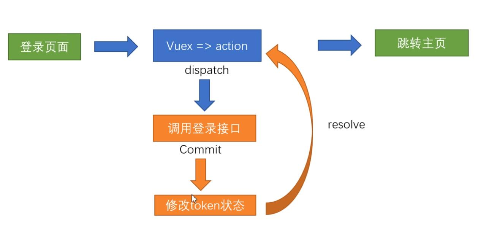

### 表单数据提交

> 步骤：
>
> 1.进行判空/数据类型验证，并阻止默认行为；
> 2.添加数据处理；
> 3.清空对应表单；

 	


### 子组件操作数组数据

> 例：子组件删除父组件数组数据
>
> 步骤：
>  1.子组件发起删除指令，传递给父组件(通过自定义事件)；
>  2.父组件接收自定义删除事件(删除操作在自定义事件的方法里面)：
>    2.1使用 `findIndex()` 方法通过 id找到目标删除元素的索引 ；
>    2.2通过 `splice()` 方法来进行删除；


### 数据本地缓存(存储)

> 步骤：
>  1.什么时候存？`localStrorage.setItem`
>
> ​		当 list（数据列表）发生修改时，需要进行本地缓存的更新 — 通过监听器 `watch` 进行监听；
> 2.什么时候取？`localStrorage.getItem`
>
> ​		 定义list（数据列表）时，就应该去缓存中读取(若没有数据，则通过 || 符号 为对应的空的该类型)；


### 根据不同的状态展示不同的数据

  > 总结论：
  >
  > 1. 只要是做列表数据的不同状态的筛选时， 一定有两条数据结构（1. 源数据 2. 展示数据）;
  > 2. 不同的状态需要有一个状态变量来控制，这个变量当前的状态影响着展示数据的内容;
  >
  > 页面样式：
  >
  > 1. 在控制展示数据的组件中，创建一个状态变量，表明该变量有着怎样的赋值规则 （或用数字来表示状态， 用英文单词来表示状态），必须要在该变量的后面写上说明;
  > 2. 通过当前设置的变量，给页面中的各个标签设置动态样式（通过设置的变量来判断true还是false）;
  > 3. 通过绑定点击事件(或其他事件)，对不同的切换按钮设置改变当前状态变量的逻辑(分别数据在哪里)；
  >
  > 数据处理
  >
  > 1. 分辨数据在哪处理，在父组件中做数据处理，需要子组件通知父组件（通过自定义事件）；
  > 2. 父组件中需要获取到当前展示的状态值，来生成展示的列表数据 - 状态变化导致展示数据变化 ：
  >      	      计算属性中的依赖项就是这个状态值
  >                     	      计算属性的返回值就是展示的列表数据
  > 3. 将计算属性返回的展示数据，传给其他的子组件；


### 登录模块的实现步骤

  > 1. 渲染静态页面；
  >
  > 2. 进行表单数据验证规则的设置，注意可以配合UI库的表单验证规则进行验证；
  >
  > 3. 点击登录或按下enter键后进行登录；
  >
  > 4. 4.1 登录时调用vuex中actions里面的登录异步方法进行发送请求(因为登录一般都会将返回的token储存到vuex和本地储存中，actions的异步方法再通过接口获取数据 ；
  >
  >    4.2 调用mutations里面的储存数据的方法将token储存到vuex中和本地储存当中)；
  >
  >    4.3 在处理返回数据时需要对返回的状态进行判断给页面做出对应的提示（可以在响应拦截器里面去做返回数据的统一处理、报错信息的提醒、当返回的数据有误时，**主动抛出异常（throw new Error(报错提示)**）好让页面在返回数据有误后不再跳转，但之后页面调用接口时就不能再用*try-catch*） ；
  >
  > 5.  登录成功后进行页面跳转(this.$router.push('路由路径'))；

登录流程如下图：



### 加载图片资源出错时的处理方式

原理：当请求图片资源找不到时，我们默认给一张图片；

方式1：通过事件监听 =》*error* 事件监听图片是否出错，出错时结合 *ref* 获取图片元素，给其src属性添加一张默认的图片；


### 空对象的判断

```js
//转换数据类型,方式1-转换成字符
// console.log(JSON.stringify(obj) === "{}") //true

//转换数据类型,方式2-转换数组再判断数组长度->利用Object.keys()
// Object.keys({username: 'zs', age:20}) // ['username', 'age']
// console.log(Object.keys(obj).length === 0) //true

//转换数据类型,方式3-判断肯定会存在属性
// console.log(obj.id === undefined) //true
```


